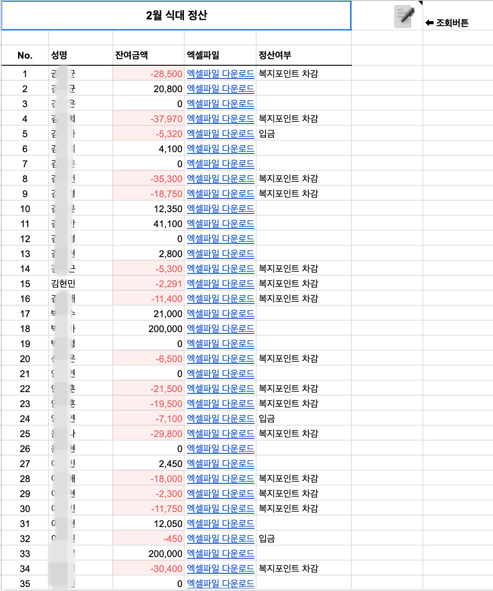

외부 방화벽 설정 변경이 불가능하다는 피드백을 듣고 해결방안을 생각해 내야 했다.

사내 서버에 무슨일이 있어도 외부 접근은 불가능하다고 하셨으니, 

그 파일들을 내 AWS 버켓에 올려서 작업해야겠다고 판단했다.

그러면 방화벽 설정도 내가 할 수 있고, 접근도 훨씬 용이할 것 같았다.  

&nbsp;

일단 방향은 잡았으니 기능을 구현해보자.

1. 점심조 제비 뽑기
2. Google 스프레드 시트 연동
3. FullCalendar로 달력에 식대 입력 표시
4. HammerJS로 달력 이동 및 식대 내역 삭제
5. Excel CRUD

&nbsp;
### [gsap 라이브러리](https://gsap.com/)
점심조 제비 뽑기를 위해 필요한 애니메이션 라이브러리.

실제 카드를 뽑는 UX를 위해서, 버튼을 누르면 카드를 섞고 일정시간 후 결과가 카드 뒷면에 나오는 방식


자세한 구현 내용은 여기서


### 구글 스프레드시트 연동

#### 점심조 시트
점심조 제비뽑기 결과를 P&C팀과 직원들이 모두 확인할 수 있어야 한다.
서버가 없는 상황이라 구글 스프레트 시트를 서버 개념으로 사용하고자 했다.

우선 약속을 정했다. 

점심조 뽑기 공지 전, 구글 스프레드 시트에서 필수 입력 값을 입력한다. (노란색 칸)
입력 후 오른쪽 네잎클로버 버튼을 누르면 파란색 칸이 지정이 된다. (수가 안맞는 칸은 랜덤으로 조에 들어간다. )


#### 정산시트
또한, 정산 금액을 한번에 확인하기 위한 시트도 만들었다.  
기존에 작업방식은 일일이 엑셀파일을 들어가서 잔액을 확인한다고 들었다. 😵‍💫



&nbsp;


### Excel 관련 라이브러리
이전에 Excel 관련 라이브러리를 사용하던게 있어서 수월하게 CRUD 작업을 해나갔다.

**ExcelJS vs xlsx**  
ExcelJS 와 xlsx 라이브러리 2개의 선택지가 있었는데,  
ExcelJS는 기존 엑셀 안의 셀 스타일 그대로 데이터 입력, 값 호출이 가능했고,  
xlsx는 입력하면 기존 셀 스타일이 초기화 되었다. (능숙하지 않아서 그럴 수도 있지만, ExcelJS가 사용하기에 비교적 편리했다.)


&nbsp;


### [HammerJS 라이브러리](https://hammerjs.github.io/)
내가 다른 앱을 사용할 때를 생각해봤을 때, 모바일 달력에서 다음달, 이전달 이동 시 주로 스와이프로 넘겨서 확인한다고 생각햇다.

그래서 이런 제스처를 처리할 수 있는 라이브러리를 찾다가 HammerJS 라이브러리를 발견했다.


해당 기능을 적용한 기능들
- 달력 월 이동
- 작성내역 삭제


실제로 사용방법이 매우 간단했다.

1. 요소를 찾아 Hammer인스턴스를 생성하고, 알맞은 parameter를 넣는다.

2. type에 맞춰 알맞은 함수를 넣으면 끝  
    
    ```javascript
    let calendarEl = document.getElementById("calendar");

    ...

    var hammer = new Hammer(calendarEl);
      hammer.on("swipeleft swiperight", function (e) {
        e.preventDefault(); // 기본 스와이프 동작 방지
        if (e.type == "swipeleft") {
          calendar.next();
        } else {
          calendar.prev();
        }
      });
    ```

    ```javascript
    export const swipeBox = (element) => {

      // Hammer 인스턴스 생성
      const hammer = new Hammer(element);

      // 변수 추가: 이동 거리 저장
      let currentDeltaX = 0;

      // 오른쪽 방향으로의 pan 이벤트 감지 설정
      hammer.on("panright panend", function (ev) {
        // panright 이벤트 처리
        if (ev.type === "panright") {
          // 이동 거리 계산 (최대 50px)
          currentDeltaX = Math.min(ev.deltaX, 50);

        }

        // panend 이벤트 처리
        if (ev.type === "panend") {
          // 슬라이드 동작이 완료되었을 때 실행할 이벤트
          if (currentDeltaX >= 40) {
            const mealType = element.classList[1];
            // 40px 이상 이동했을 때만 이벤트 실행
            resetBtn(mealType);
            // 여기에 원하는 동작을 추가하세요
          }

          // 이동 거리 초기화
          currentDeltaX = 0;
        }
      });
    };
    ```
    


---


### AWS Lightsail
&nbsp;

동료분이 [AWS Lighsail](https://aws.amazon.com/ko/free/compute/lightsail/?trk=5ee88988-35e0-4ac4-b54f-913791232630&sc_channel=ps&ef_id=Cj0KCQjwna6_BhCbARIsALId2Z3wW8fIIrJdoQCMC-qz2Z8CBsJKVJHCgOUFYREl-zHNO_nImBVJ3OkaAsWHEALw_wcB:G:s&s_kwcid=AL!4422!3!536392904551!e!!g!!lightsail!11549848931!116492045190&gclid=Cj0KCQjwna6_BhCbARIsALId2Z3wW8fIIrJdoQCMC-qz2Z8CBsJKVJHCgOUFYREl-zHNO_nImBVJ3OkaAsWHEALw_wcB)을 말씀해 주셔서 살펴보았는데, 클릭 몇번만으로 간단하게 EC2 생성이 가능했다.
또한 도메인, S3 등 보기 쉽게 정리되어 있어서 사용해보기로 했다.


[](https://aws.amazon.com/ko/free/compute/lightsail/?trk=5ee88988-35e0-4ac4-b54f-913791232630&sc_channel=ps&ef_id=Cj0KCQjwna6_BhCbARIsALId2Z3wW8fIIrJdoQCMC-qz2Z8CBsJKVJHCgOUFYREl-zHNO_nImBVJ3OkaAsWHEALw_wcB:G:s&s_kwcid=AL!4422!3!536392904551!e!!g!!lightsail!11549848931!116492045190&gclid=Cj0KCQjwna6_BhCbARIsALId2Z3wW8fIIrJdoQCMC-qz2Z8CBsJKVJHCgOUFYREl-zHNO_nImBVJ3OkaAsWHEALw_wcB)

&nbsp;

### 배포

어느정도 기본적인 기능을 거의 개발한 뒤 배포작업만 남았다.

**엑셀 원본 파일 관리**  
우선 원본 엑셀 파일들을 버킷에 옮겼다.

**배포**  
Ubuntu환경 인스턴스에 업로드했다.
아직은 주소가 IP주소로 접속해야 하는 상황.

**PM2**  
무중단 서비스를 위해서 PM2 세팅을 했다.


**CI/CD**  
사내에서 CI/CD 세팅 후 편리함을 느껴서 여기에도 추가했다.  
`main` 브랜치에 Pull Request를 하면 자동으로 EC2에 코드가 업데이트된다.

```yaml
name: Deploy to AWS Lightsail

on:
  push:
    branches:
      - main

jobs:
  deploy:
    runs-on: ubuntu-latest

    steps:
      - name: Checkout code
        uses: actions/checkout@v2

      - name: Set up Node.js
        uses: actions/setup-node@v2
        with:
          node-version: "18"

      - name: Install dependencies
        run: npm install

      - name: Deploy to Lightsail
        env:
          SSH_PRIVATE_KEY: ${{ secrets.SSH_PRIVATE_KEY }}
          LIGHTSAIL_IP: ${{ secrets.LIGHTSAIL_IP }}
        run: |
          echo "${SSH_PRIVATE_KEY}" > acg-extension-lightsail.pem
          chmod 600 acg-extension-lightsail.pem
          ssh -i acg-extension-lightsail.pem -o StrictHostKeyChecking=no ubuntu@${LIGHTSAIL_IP} "echo SSH connection established"
          rsync -avz --exclude='node_modules' -e "ssh -i acg-extension-lightsail.pem -o StrictHostKeyChecking=no" ./ ubuntu@${LIGHTSAIL_IP}:/home/ubuntu/acg-extension
          ssh -i acg-extension-lightsail.pem -o StrictHostKeyChecking=no ubuntu@${LIGHTSAIL_IP} "cd /home/ubuntu/acg-extension && npm install"
```


