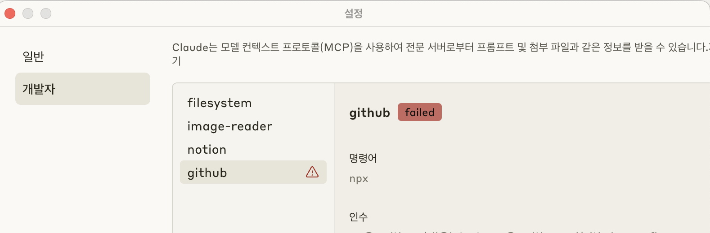
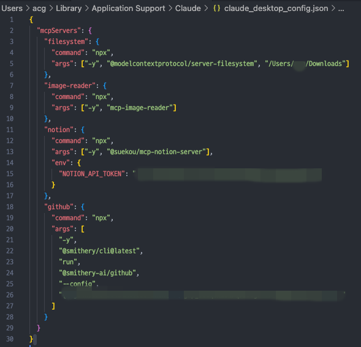
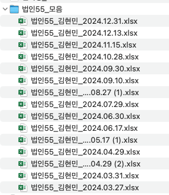
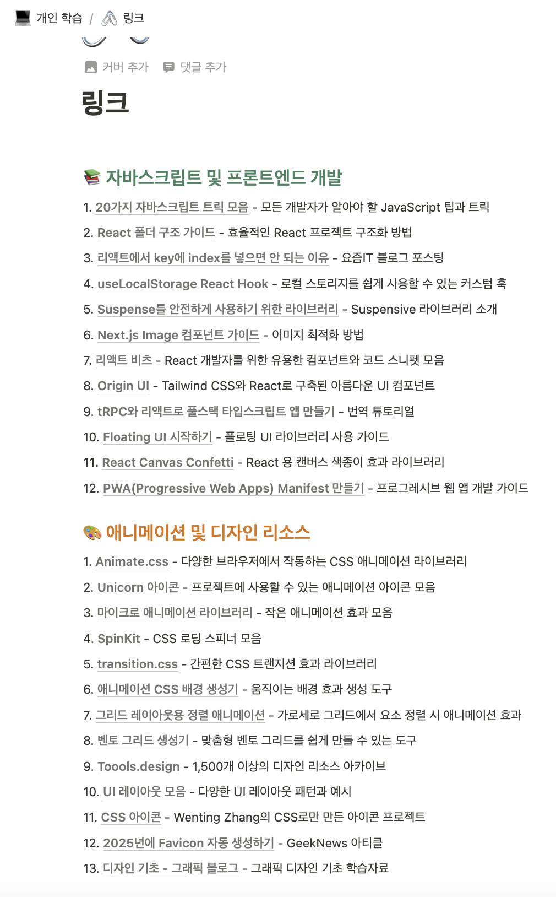

우연히 알게된 MCP

유튜브에서 뭔지 찾아보다가 매우 획기적인 도구라고 소개되고 있었다.

실제 활용영상을 보니 엄청난게 맞다.

클로드 또는 Cursor 호스트 클라이언트에 MCP 서버라는 것들을 끼워 넣으면, 

호스트 클라이언트는 MCP서버에 접속해 해당 요청을 처리한다.

&nbsp;

기존에는 AI에게 명령을 입력하면, 웹상에서 찾아서 가공하고 데이터를 보여주는 방식.

MCP를 이용하면 웹 뿐만 아니라 내 로컬 컴퓨터, 내 노션 데이터베이스 , 내 깃헙까지 들어가서 LLM처리를 할 수 있다. 즉, '나만의 비서'라는 말에 한걸음 더 가깝다.

개념을 알고 나니, 기존에 사람이 했던 단순업무들을 빠르게 대체할 아이디어가 몇개 떠올랐었다.

이미 나와있는 수많은 MCP 

[MCP서버 모음](https://github.com/punkpeye/awesome-mcp-servers/blob/main/README-ko.md)

[Smithery](https://smithery.ai/)

MCP서버는 스스로도 만들 수 있는데, 프롬프트 작업도 해야해서 추후에 생각해 보기로 하고, 우선 나와있는 MCP서버를 잘 활용해보는데 집중하기로 했다.

### 사용법

사용법도 매우 간단했다.

**우선 클로드 유료계정만 가능함!**

1. 클로드 PC 다운로드

2. 환경설정 - 개발자 - 설정편집 클릭
    

3. 아래 파일이 포커싱되면, 파일을 연다.
    

4. json형식 파일이 나오는데, `mcpServers`키 안에 계속 추가시키면 된다.
    

---

### 내 컴퓨터에서 파일 모아서 정리해줘

mcpServsers중에 `filesystem`을 이용

내 폴더에 실제로 해당 파일이 어디에 존재하는지 하나하나 파악하기가 어려웠다.

파일을 찾아서 하나로 묶은 폴더를 만들어서 거기에 정리해달라고 요청했다.

당연하지만, 파일명도 알아서 만들어준다

### 노션에 링크 페이지 정리해줘

노션 mcpServsers를 추가하고 노션 API 사이트에 가서 API키를 받아 넣으면 끝.

[노션 API](https://www.notion.so/profile/integrations)

'링크'라는 페이지 안에 있는 링크주소들 한글로 정리하고 카테고리별로 분류해줘.
결과

---

MCP는 USB-C포트와 많이 비유가 된다.

실제로 사용해보니, 그 말이 바로 와닿았고,

작은 디테일이라고 생각했던 것들이(나에게 접근 가능 여부 등등..) 엄청난 나비효과를 불러 일으킨다는 것을 깨닫게 되었고, 이로 인해 많은 아이디어가 떠올라 조만간 재밌는 경험을 많이 할 수 있을 것 같다.

