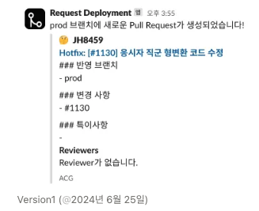
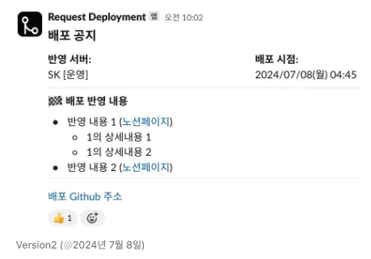
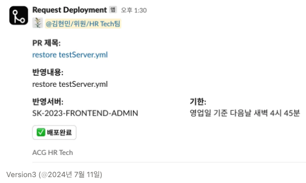

## 배경

안전(?)상의 이유로 운영서버는 사람이 직접 배포하는 방식이고, 테스트 서버는 GitActions가 설정되어 있어서 자동배포가 되어있다.

아래 문제들로 인한 가려움을 조금이나마 긁어보고자 앱을 만들어 보았다.

1. 일일이 배포 요청을 해야하니 번거로웠다.
2. 배포완료 여부 확인이 어려웠다.

## 사용법

1. 사용자가 개발 완료 후, Github `prod` 브랜치에 Pull Request
2. 배포 담당자가 해당 배포요청 알람 메세지를 확인한다.
3. 배포를 완료하면 `배포예정` 버튼을 클릭해 배포상태를 표시해준다.

## 개발 Overview

1. firebase functions에 배포
2. 슬랙 Setting에서 배포된 도메인 설정
3. Github Settings에 슬랙 `SLACK_WEBHOOK_URL` 설정
    1. 슬랙 `SLACK_WEBHOOK_URL` , `SLACK_SIGNING_SECRET` , `SLACK_BOT_TOKEN`을 설정해준다.
    2. 깃헙 Settings - Webhook 부분에 슬랙 `SLACK_WEBHOOK_URL` 을 입력해준다.
    3. 깃헙 Settings - Webhook에서 `PR`을 보냈을 때만, `SLACK_WEBHOOK_URL`을 전송한다 옵션을 선택한다.
    4. 전송요청을 받을 때, 브랜치 정보를 받을 수 있어서 배포 브랜치인 `prod` 브랜치에 해당할 때만 슬랙에 요청한다.
    5. 요청할 때, 메신저에 어떻게 보여질지는 슬랙 홈페이지를 참고하면 된다. 
        
        [Designing with Block Kit](https://api.slack.com/block-kit/designing)
        
    

## History

