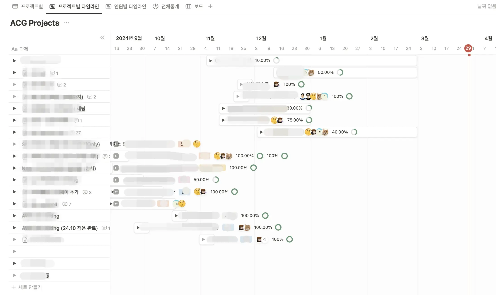
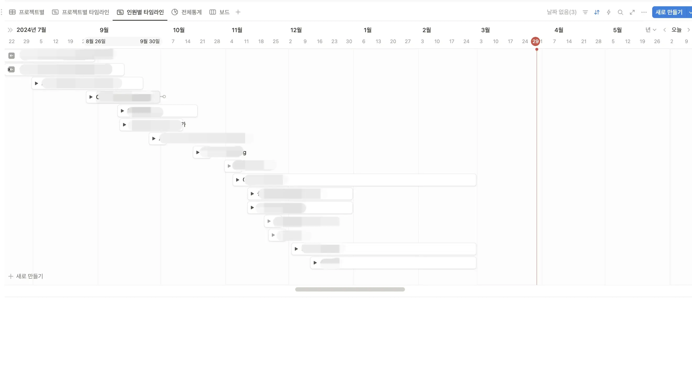
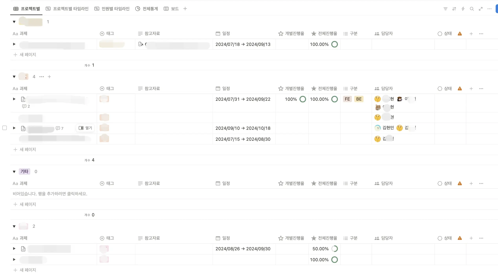
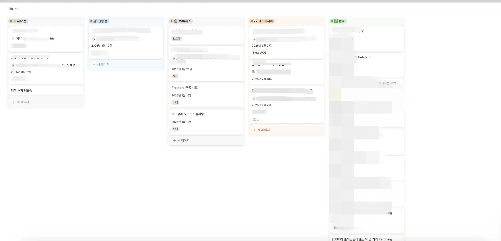
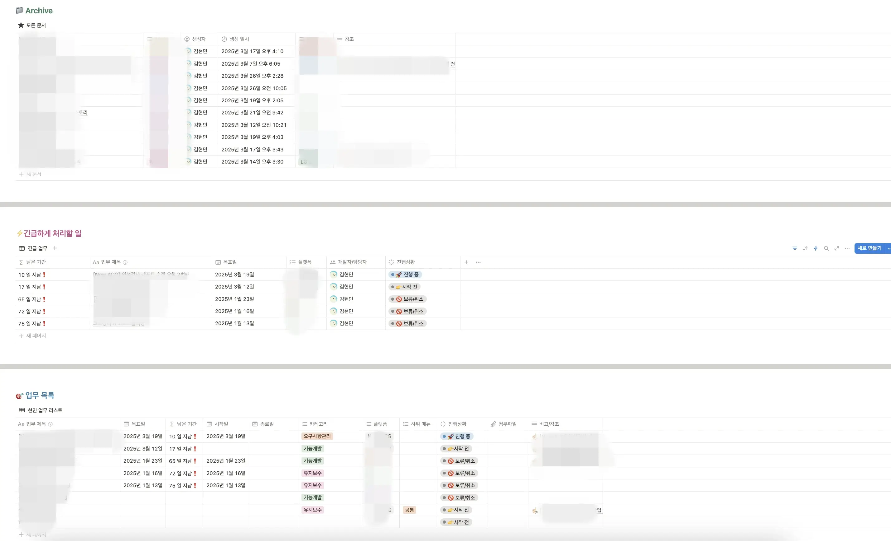

2025년 1월 2일 

조직개편이 진행되면서 팀장님이 새로 임명되셨다.

조직 개편 전에는 팀장없이 본부장님 바로 밑 우리팀이였다.

(본부장님도 2024년도 하반기에 새로 오셨었다.)  

&nbsp;

이 앱 제작의 배경을 생각해보면 작년 본부장님이 새로 오신 후부터 인것 같으니, 본부장님으로 부터 시작된 템플릿 히스토리를 먼저 적어야 할 것 같다.

본부장님이 새로 오시면서 원활한 업무 파악 및 진행을 위해 나에게 노션 템플릿 제작요청을 하셨다.

요구사항이 명확하지 않고 수시로 바뀌는 이슈가 있었지만.. 아쉬운대로 사용하기로 했었다.

*아래는 실제 사용했던 템플릿 예시*

하지만,, 한번에 모두의 입맛을 충족시킬 수는 없었다.

그렇다면 아쉬운게 무엇이었을까?

1. 기록이 잡무가 됨
    
    각자 진행한 업무에 대해 *업무 시작일, 완료일, 목표일, 상태* 등을 각각 직접 상태를 변경해야 한다는 번거로움.(이미 각자 페이지에서 하고 있는 일.)
    
    여기서 업무 진행 특성상 *완료일이 완료일이 아닌 경우*가 매우 빈번히 일어났기 때문에, 가장 중요한 문제엿다.
    
2. 정확하지 않은 업무 진행률
    
    1번에서 언급한 “*완료일이 완료일이 아닌 경우”* 파생되는 문제로 생각된다. 
    
    업무에 대해 완벽한 기준이 없다. 
    
    고객사가 OK하면 완료이다. 불만족인지, 만족인지, 끝이 난건지 검토중인지도 모를 업무들이 대다수다.
    
    *본부장님도, 대표도 어쩔 수 없는 ‘을’의 위치..*
    
    이런 상황에서 퍼센트를 기록하는건 의미가 없다고 판단되었다.
    
3. 모호한 업무 기록 기준
    
    또한, 각자 업무 기록에 대한 depth가 다르다.
    
    어느 업무 선까지 적어야 하는가?
    
4. 관리의 책임
    
    본부장님은 능동성을 내세우며 우리팀이 각자 적어서 진행하길 원하셨다.
    
    하지만, 본부장님이 작성하는게 맞다고 판단해 작성을 부탁드렸다. 
    
    의사결정권자를 가진 분들과 가장 밀접하게 소통하는 분이며, 팀원의 업무 상황, 정확한 일정을 수시로 파악하셔야 하는 분이라고 생각했기 때문이다. 팀을 이끌기 위해서는 가장 중요한 데이터 아닐까..
    
    본부장님도 동의하셔서 이제 진행이 되려나 했다.
    
    ~~하지만, 노션 과외시간이 생겼고, 업데이트가 느렸다.~~
    
5. 배보다 배꼽이 더 크다
    
    요구사항은 많고, 기준은 정립해주지 않아 모호하다.
    
    결국 자동화된 무언가를 원하시는 것 같은데 *GUEST 계정*에선 불가능하다.
    
    자동화를 위해 유료결제 요청했지만 반려.
    

→ 결국 위의 문제들로 인해 **팀 공용 템플릿**을 정하자. 

각자 페이지에 적는 테이블을 한 템플릿으로 통일하자.

&nbsp;

아래는 내가 제안한 팀 공용 템플릿

감사하게도 팀원 모두 좋다는 의견을 주셨다.

결국, 각자 페이지에서  각자 업무를 템플릿에 작성하고, 

본부장님은 페이지에 들어가서 각자 업무 일정을 파악하는 방향으로 좁혀졌다.

*ps.문서아닌 문서로 정확한 업무파악 & 이슈 공유는 어렵지 않을까 해서 추가로 주간회의 시간을 갖자고 제안했지만 한번 하시고 그 이후로 안하셨다. 😨*

[Notion 자동화 개발 -2](/dev/web/frontend/2024-06-25-노션%20업무%20템플릿-2/)