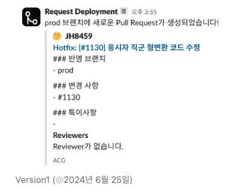
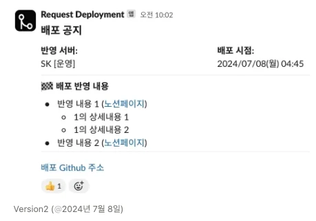
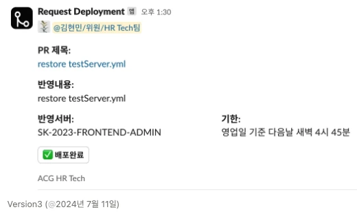
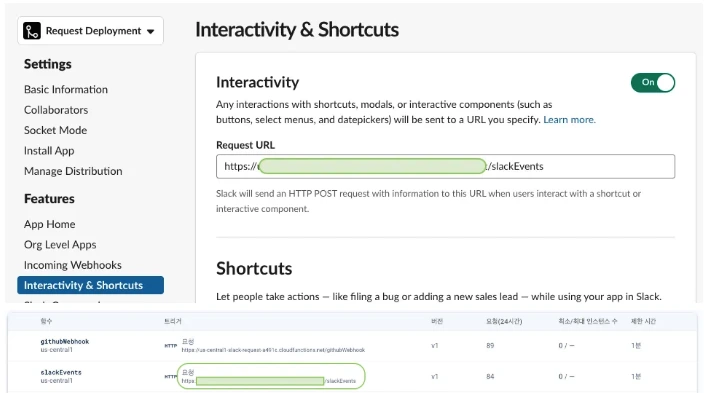

## 배경

테스트 서버는 GitActions CI/CD 설정이 되어있었지만, 안전(?)상의 이유로 운영서버는 사람이 직접 배포하는 방식이다.

직접 배포하다 보니 이런 불편함이 생겼다.

1. 일일이 배포 요청을 해야함.
2. 배포완료 여부 확인이 어려움.

조금이나마 이런 불편함을 개선하고자 앱을 만들어 보았다.

## 동작

1. 개발자가 개발을 완료하면, Github `prod` 브랜치에 Pull Request 한다.
2. 배포 담당자가 해당 배포요청 알람 메세지를 확인한다.
3. 배포를 완료하면 `배포예정` 버튼을 클릭해 배포상태를 표시해준다.

## 개발 Overview

1. firebase functions에 배포
    - 도메인 확인
2. 슬랙 Setting에서 1번에서 받은 도메인을 설정
3. Github Settings에 슬랙 `SLACK_WEBHOOK_URL` 설정
    1. 슬랙 `SLACK_WEBHOOK_URL` , `SLACK_SIGNING_SECRET` , `SLACK_BOT_TOKEN`을 설정해준다.
    2. 깃헙 Settings - Webhook 부분에 슬랙 `SLACK_WEBHOOK_URL` 을 입력해준다.
    3. 깃헙 Settings - Webhook에서 `PR`을 보냈을 때만, `SLACK_WEBHOOK_URL`을 전송한다 옵션을 선택한다.
    4. 전송요청을 받을 때, 브랜치 정보를 받을 수 있어서 배포 브랜치인 `prod` 브랜치에 해당할 때만 슬랙에 요청한다.
    5. 요청할 때, 메신저에 어떻게 보여질지는 슬랙 홈페이지를 참고하면 된다. 

        [Designing with Block Kit](https://api.slack.com/block-kit/designing)

## 레이아웃 버전

1. 버전1


2. 버전2


3. 버전3 (최종)



## 버튼 클릭 이벤트 기능 추가 관련 (Version 3)


> **버튼 이벤트를 연동하는 방법 (slack api)**
> 1. blocks 안에 `type`을 `action`으로 설정
> 2. `elements`배열 안에 `action_id` 값을 지정한다 (가장 중요)
> 3. slack/bolt 로 `app` 을 만들고, `app.action` 의 첫번째 인자로 2번의 `action_id` 값을 넣는다.


&nbsp;

**🪲 발생 에러 :**

`Function execution took 132 ms, finished with status code: 404` 

- Firebase Console에 로그가 찍히지 않음
    
    ⇒ firebase functions에서 할당된 URL주소를 Slack API - Interactivity & Shorcuts - RequestURL에 입력하는 값을 일치시켜야 함
    
    
    
    애초에 `app.action`으로 진입을 못한다.


- routing을 해주는 `receiver` 로 묶어 보았지만 같은 에러 발생
    ```javascript
    exports.slackEvents = functions.https.onRequest(receiver.app);
    ```
    
- **3번째 시도**
    
    `TypeError: Cannot read properties of undefined (reading 'apply')`
    무슨의미인지 알기 어렵다.. 찾아보니 Slack App 초기화에 대한 내용만 나오지만 같은 에러 반복
    
- **4번째 시도**
    
    app.action으로 라우팅을 못해 찾지 못한다면 `exports.slackEvents = functions.https.onRequest` 부분까지는 실행이 되니까 이 안에서 로직을 처리하자.
    
    대신 slack/bolt를 사용하지 않고, 직접 axios로 데이터를 받고 보내야 함
    
    > *( slack/bolt 사용 시 장점 : `client.chat.update` 등의 api를 활용해 데이터를 보낼 수 있다. )*
    > 
    
    하지만 실제 코드 양은 거의 차이가 없었으므로, **axios로 post 하기로 결정**
    

---

**🌟 해결 (기능 동작)**

`exports.slackEvents = functions.https.onRequest` 안에서 직접 req.payload를 확인할 수 있었고 `response_url` 을 확인할 수 있었다.

그래서 받은 `response_url`로 `post`를 하니까 정상적으로 요청되었다.

**+ 보완점**

`slack/bolt` 에서 firebase functions에 거쳐서 요청을 하다보니 firebase 쪽에서 디버깅하기가 쉽지 않았고, Slack Interactivity 부분은 로컬모드로 실행하지 못해서 계속 배포를 진행하면서 디버깅했다.

로컬모드로 실행하면서 디버깅 하는 방법과 slack/bolt에서 정상적으로 라우팅하는 방법을 찾아봐야 할 것 같다.