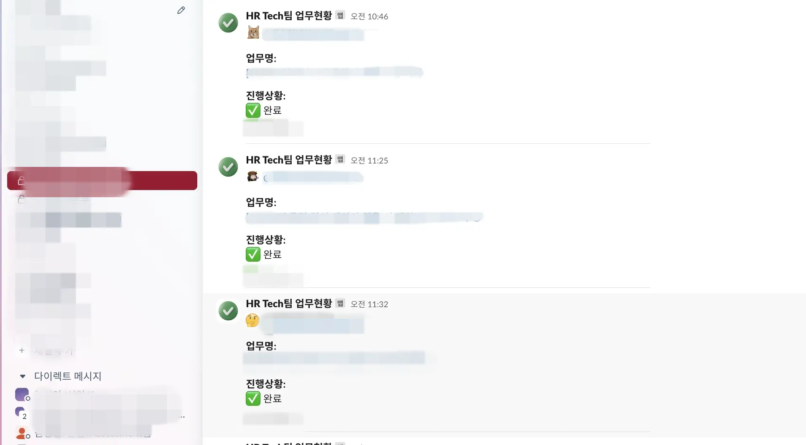
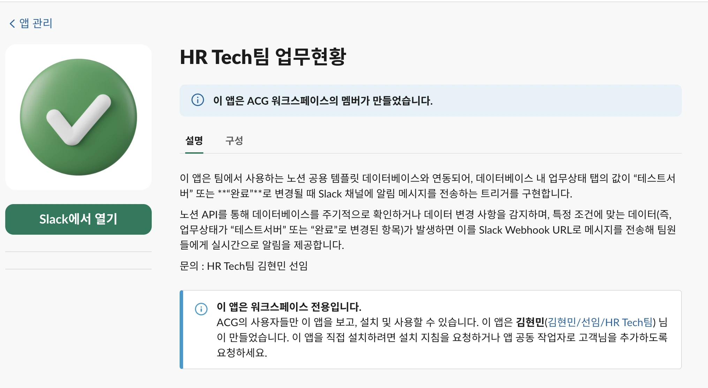

2025년 1월 7일 

유야무야 시간이 지나고 회사에는 조직개편이 진행되었다.

드디어 우리팀에도 팀장님이 생겼다.

&nbsp;

팀장님의 요청으로 팀장님에게 기존 본부장님 맞춤 템플릿을 공유했다.

썩 마음에 들지 않으신 눈치..!

&nbsp; 

팀장님은 본인이 필요한 내용을 엑셀에 정리해서 주셨다.

그래도 원하는바가 확실히 있으셔서 만들기엔 전보다 수월했다. 

1. 테이블 열 정보
2. 필드내용
3. 업무 작성 범위 기준 → 최대한 세세하게 작성할 것. 자세할수록 좋다.

&nbsp; 

하지만, 모두의 니즈를 충족하려면, *자동화* 가 되어야 한다.

1. 업무현황을 진행중으로 변경 → 시작일자를 자동으로 당시 일자로 적용
2. 업무현황을 테스트서버 또는 완료로 변경 → 종료일자를 변경 당시 일자로 적용
3. 완료상태가 되면 그 건에 대해서 알림을 받고싶다.

팀원 모두 *GUEST* 계정이라 자동화 기능은 사용 불가능했다.

유료계정이 있는 P&C팀원에게 부탁해 자동화를 하나씩 붙여나갔다.

1,2번은 매우 간단했지만,

3번은 별도의 슬랙 App이 필요했다.

이전에 배포요청 시 만들었었던 앱을 바탕으로 firebase functions 를 활용해 만들기로 했다.

---

<strong>✍️ Firebase를 활용한 슬랙 앱 제작 대략적인 순서</strong>

1. firebase functions 에 배포
2. slack api 사이트에서 webhook 설치 승인
3. **google IAM에서 배포된 앱 접근 권한을 `allUsers` (상수) 로 세팅해 주어야 한다.**
    
    [함수에 대한 액세스 사용 설정 공식 문서](https://cloud.google.com/functions/docs/securing/managing-access-iam?hl=ko#enabling_access_to_a_function)
    
4. 배포된 URL 주소로 notion 자동화 webhook URL 주소에 입력
5. 슬랙에 나타낼 정보 골라서 리턴.

firebase functions로 배포된 도메인을 notion에서 제공하는 웹훅 url에 넣어 **완료** 이벤트가 발생할 때마다 슬랙 채널에 해당 정보를 받아볼 수 있게 되었다.

--- 

아래는 실제 사용화면

